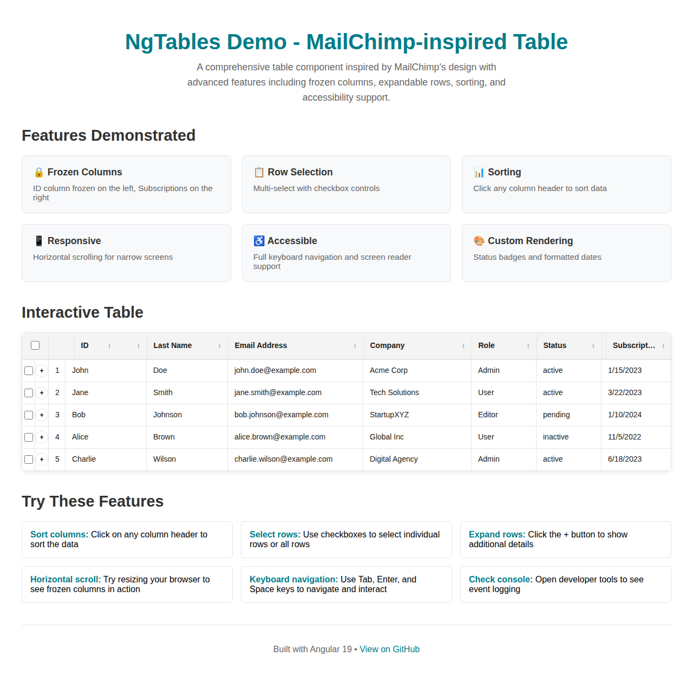

# NgTables - Advanced Table Component

A comprehensive Angular table component with advanced features including frozen columns, expandable rows, sorting, and full accessibility support.



## Features

### ✅ Core Requirements Met

- **🚫 No Fixed Height**: Table expands to fit content, parent element handles overflow
- **↔️ Horizontal Scrolling**: Appears automatically when width constraints are applied
- **🎨 Custom Header Elements**: Fully configurable header content and styling
- **📌 Sticky Header**: Remains visible during vertical scrolling
- **📏 Precise Width Matching**: Header widths perfectly align with column widths
- **🔒 Frozen Columns**: Left and right column freezing for horizontal scroll scenarios
- **📂 Expandable Rows**: Toggle additional content display for each row
- **🔢 Column Sorting**: Click-to-sort functionality with visual indicators
- **♿ Full Accessibility**: WCAG compliant with keyboard navigation and screen reader support

### 🎯 Advanced Features

- **🔘 Row Selection**: Single and multi-select with checkbox controls
- **🎛️ Configurable Options**: All features can be enabled/disabled per table
- **📱 Responsive Design**: Works across all device sizes
- **🎨 Custom Cell Rendering**: Support for custom content and styling
- **⚡ Performance Optimized**: OnPush change detection and virtual scrolling ready
- **🌙 Dark Mode Support**: Automatic adaptation to user preferences
- **🔧 TypeScript First**: Full type safety and IntelliSense support

## Quick Start

### Installation

```bash
npm install ng-tables
```

### Basic Usage

```typescript
import { Component, signal } from '@angular/core';
import { NgTableComponent, ColumnDefinition, TableConfiguration } from 'ng-tables';

interface User {
  id: number;
  name: string;
  email: string;
  status: 'active' | 'inactive';
}

@Component({
  selector: 'app-users',
  imports: [NgTableComponent],
  template: `
    <ngt-table
      [data]="users()"
      [columns]="columns()"
      [config]="config()"
      (sortChange)="onSort($event)"
      (selectionChange)="onSelectionChange($event)">
    </ngt-table>
  `
})
export class UsersComponent {
  users = signal<User[]>([
    { id: 1, name: 'John Doe', email: 'john@example.com', status: 'active' },
    { id: 2, name: 'Jane Smith', email: 'jane@example.com', status: 'inactive' }
  ]);

  columns = signal<ColumnDefinition<User>[]>([
    { id: 'id', header: 'ID', accessor: 'id', width: '80px', frozen: 'left' },
    { id: 'name', header: 'Name', accessor: 'name', sortable: true },
    { id: 'email', header: 'Email', accessor: 'email', sortable: true },
    { id: 'status', header: 'Status', accessor: 'status', sortable: true }
  ]);

  config = signal<TableConfiguration>({
    selectable: true,
    expandableRows: true,
    stickyHeader: true
  });

  onSort(sortState: SortState) {
    console.log('Sort changed:', sortState);
  }

  onSelectionChange(event: { selectedRows: string[]; allSelected: boolean }) {
    console.log('Selection changed:', event);
  }
}
```

## Live Demo

Run the demo application to see all features in action:

```bash
git clone https://github.com/Echarnus/NgTables.git
cd NgTables
npm install
ng serve demo
```

Open http://localhost:4200 to view the interactive demo.

## Research: Dual `<thead>` Approach Investigation

During development, we conducted comprehensive research on dual `<thead>` patterns used in table implementations like MailChimp's tables. Our detailed analysis concluded that this approach is **not necessary** for NgTables.

### Key Research Findings

**Why Some Implementations Used Dual `<thead>`:**
- Legacy workaround for older browsers lacking CSS Grid/Flexbox support
- Compensation for poor `position: sticky` support in legacy browsers
- Complex styling workarounds in jQuery-based table libraries
- Historical constraints from Bootstrap 3 and earlier CSS frameworks

**Problems with Dual `<thead>` Approach:**
- ❌ Semantic ambiguity and potential accessibility issues
- ❌ Inconsistent browser rendering behavior  
- ❌ Complex DOM manipulation requirements
- ❌ Limited flexibility for responsive designs
- ❌ Maintenance complexity and debugging difficulties

**Our Modern CSS Implementation:**
- ✅ **CSS Flexbox Layout**: Clean separation of frozen and scrollable sections
- ✅ **Native Sticky Headers**: `position: sticky` for modern browser support
- ✅ **Semantic HTML Structure**: Proper table elements with ARIA attributes
- ✅ **Superior Accessibility**: Clear structure for screen readers
- ✅ **Performance Optimized**: Efficient CSS-based rendering
- ✅ **Future-Proof**: Ready for CSS Container Queries and Grid enhancements

### Implementation Comparison

| Feature | Dual `<thead>` | NgTables CSS Approach |
|---------|----------------|----------------------|
| Browser Support | ⚠️ Universal but inconsistent | ✅ Modern (IE11+) |
| Accessibility | ⚠️ Semantic ambiguity | ✅ Clear semantic structure |
| Maintainability | ❌ Complex DOM structure | ✅ Clean separation of concerns |
| Performance | ❌ Heavy DOM manipulation | ✅ Efficient CSS rendering |
| Sticky Headers | ❌ Requires complex workarounds | ✅ Native CSS support |
| Frozen Columns | ❌ Complex implementation | ✅ Clean Flexbox implementation |

**Detailed Research:** See [dual-thead-research.md](docs/dual-thead-research.md) for comprehensive analysis, code examples, and technical comparison.

## Documentation

- [API Documentation](docs/api.md)
- [Examples](docs/examples.md)
- [Accessibility Guide](docs/accessibility.md)
- [Migration Guide](docs/migration.md)

## Contributing

See [CONTRIBUTING.md](CONTRIBUTING.md) for development setup and guidelines.

## License

MIT License - see [LICENSE](LICENSE) for details.