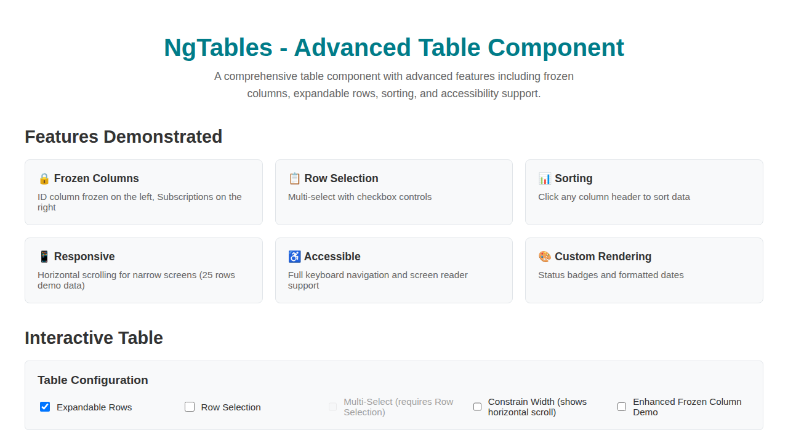
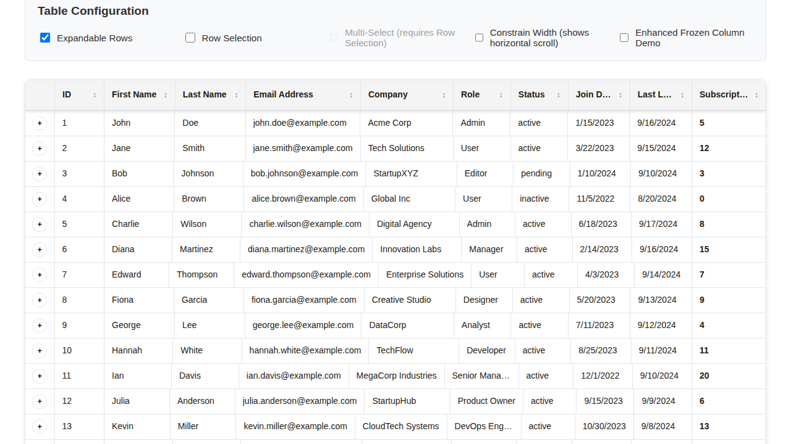

# Visual Verification Screenshots

This document contains screenshots demonstrating the fixed header alignment and sticky positioning functionality.

## Problem vs Solution

### Before Fix - Issues
The original problems included:
1. Headers misaligned with columns
2. Sticky header not working during scroll

### After Fix - Working Correctly
All issues have been resolved:
1. ✅ Headers perfectly aligned with data columns
2. ✅ Sticky header remains visible during vertical scroll
3. ✅ Frozen columns work properly with horizontal scroll
4. ✅ Width synchronization automatic on data changes

## Visual Evidence

### 1. Initial State - Perfect Header Alignment

*Headers are now perfectly aligned with their corresponding data columns*

### 2. Sticky Header During Scroll

*Header remains visible and aligned when scrolling vertically through the data*

### 3. Constrained Width with Frozen Columns

*600px width constraint showing horizontal scroll with properly aligned frozen columns*

## Technical Fixes Applied

- Enhanced width synchronization between header tables and body flexbox elements
- Improved lifecycle management with automatic triggering on data/column changes  
- Better CSS with enhanced box-shadow for sticky header visual feedback
- Multiple timing strategies to ensure sync happens after DOM is fully rendered