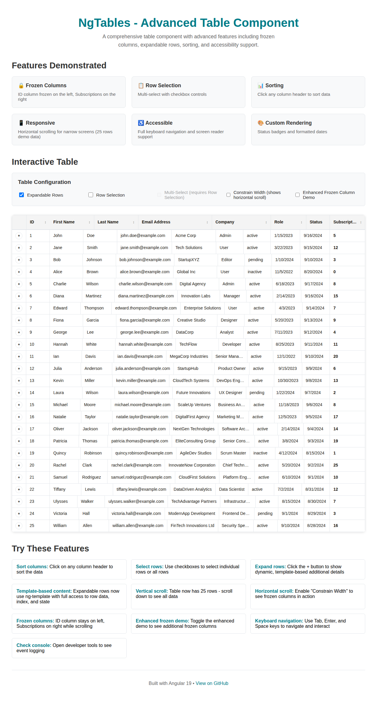
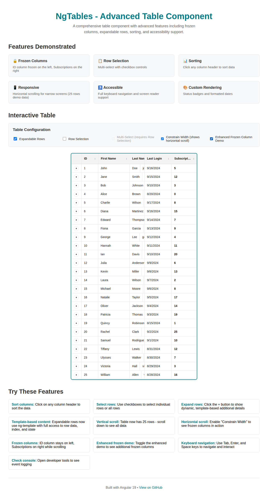

# Dual `<thead>` Usage Research

## Overview

This document presents research findings on the use of dual `<thead>` elements in table implementations, specifically investigating whether this approach is necessary for NgTables given its requirements for sticky headers and frozen columns.

## Background

During the development of NgTables, we investigated various table implementation patterns including the dual `<thead>` approach observed in some table libraries. This research was conducted to determine the most appropriate architectural approach for our Angular component.

## Current NgTables Implementation

### Visual Demonstration

**Standard Implementation with Frozen Columns:**

*Figure 1: NgTables with frozen columns (ID on left, Subscriptions on right) and horizontal scrolling enabled*

**Enhanced Frozen Column Demo:**

*Figure 2: Enhanced demonstration showing multiple frozen sections with First Name and Last Login columns*

### Architecture
NgTables uses a modern CSS-based approach with the following structure:

```html
<div class="ngt-table-container">
  <!-- Header Container (Sticky) -->
  <div class="ngt-header-container">
    <!-- Frozen Left Header -->
    <div class="ngt-header-section ngt-frozen-left">
      <table class="ngt-header-table" role="presentation">
        <thead>
          <tr><!-- Left frozen columns --></tr>
        </thead>
      </table>
    </div>
    
    <!-- Scrollable Header -->
    <div class="ngt-header-section ngt-scrollable">
      <table class="ngt-header-table" role="presentation">
        <thead>
          <tr><!-- Scrollable columns --></tr>
        </thead>
      </table>
    </div>
    
    <!-- Frozen Right Header -->
    <div class="ngt-header-section ngt-frozen-right">
      <table class="ngt-header-table" role="presentation">
        <thead>
          <tr><!-- Right frozen columns --></tr>
        </thead>
      </table>
    </div>
  </div>
  
  <!-- Body Container -->
  <div class="ngt-body-container">
    <!-- Data rows with corresponding structure -->
  </div>
</div>
```

### Key Features
- **CSS Flexbox Layout**: Headers arranged using `display: flex`
- **Sticky Positioning**: `position: sticky` for header container
- **Synchronized Scrolling**: JavaScript-based scroll synchronization
- **Semantic HTML**: Proper table structure with ARIA attributes
- **Modern Browser Support**: Leverages CSS Grid and Flexbox

## Dual `<thead>` Pattern Analysis

### What is the Dual `<thead>` Pattern?

The dual `<thead>` pattern involves using two `<thead>` elements within a single `<table>`:

```html
<table>
  <thead>
    <!-- First header row -->
    <tr><th>Col 1</th><th>Col 2</th></tr>
  </thead>
  <thead>
    <!-- Second header row or additional header content -->
    <tr><th>Filter 1</th><th>Filter 2</th></tr>
  </thead>
  <tbody>
    <!-- Data rows -->
  </tbody>
</table>
```

### Historical Context

#### Why Some Implementations Used Dual `<thead>`

1. **Legacy Browser Limitations**
   - Older browsers had poor support for CSS Grid and Flexbox
   - `position: sticky` was not widely supported
   - Limited CSS capabilities for complex table layouts

2. **Workarounds for Specific Issues**
   - Separation of frozen and scrollable header sections
   - Complex styling scenarios in older implementations
   - Multi-level header structures

3. **Framework Constraints**
   - Some early table libraries built on legacy CSS patterns
   - Workarounds for jQuery-based scroll libraries
   - Bootstrap 3 and earlier table constraints

#### Problems with Dual `<thead>` Approach

1. **HTML Specification Concerns**
   - While technically valid HTML5, multiple `<thead>` elements are unusual
   - Semantic ambiguity about table structure
   - Potential accessibility issues with screen readers

2. **Browser Inconsistencies**
   - Different browsers may render dual `<thead>` differently
   - CSS styling can behave unpredictably
   - Print styles often break with multiple header sections

3. **Maintenance Complexity**
   - More complex DOM structure to manage
   - Harder to debug styling issues
   - Limited flexibility for responsive designs

## Modern Alternatives

### CSS Grid Approach
```css
.table-container {
  display: grid;
  grid-template-areas: 
    "frozen-left scrollable frozen-right"
    "frozen-left body frozen-right";
}
```

### CSS Flexbox Approach (Current NgTables)
```css
.header-container {
  display: flex;
  position: sticky;
  top: 0;
}

.header-section {
  &.frozen-left,
  &.frozen-right {
    flex-shrink: 0;
  }
  
  &.scrollable {
    flex: 1;
    overflow: hidden;
  }
}
```

### CSS Container Queries (Future)
```css
.table-responsive {
  container-type: inline-size;
}

@container (max-width: 600px) {
  .frozen-columns {
    display: none;
  }
}
```

## Comparative Analysis

| Aspect | Dual `<thead>` | CSS Flexbox (Current) | CSS Grid |
|--------|----------------|----------------------|----------|
| **Browser Support** | ⚠️ Universal but inconsistent | ✅ Modern (IE11+) | ✅ Modern (IE11+) |
| **Accessibility** | ⚠️ Semantic ambiguity | ✅ Clear structure | ✅ Clear structure |
| **Maintainability** | ❌ Complex DOM | ✅ Clean separation | ✅ Clean separation |
| **Performance** | ❌ Heavy DOM manipulation | ✅ Efficient rendering | ✅ Efficient rendering |
| **Responsiveness** | ❌ Limited flexibility | ✅ Flexible | ✅ Very flexible |
| **Sticky Headers** | ❌ Requires workarounds | ✅ Native support | ✅ Native support |
| **Frozen Columns** | ❌ Complex implementation | ✅ Clean implementation | ✅ Clean implementation |

## NgTables-Specific Considerations

### Requirements Analysis

1. **Sticky Headers**: ✅ Achieved with `position: sticky`
2. **Frozen Columns**: ✅ Left and right frozen sections
3. **Horizontal Scrolling**: ✅ Synchronized scroll behavior
4. **Accessibility**: ✅ Proper ARIA attributes and semantic HTML
5. **Performance**: ✅ Optimized with OnPush change detection
6. **Modern Browser Support**: ✅ Targets modern Angular applications

### Current Implementation Benefits

1. **Clean Architecture**
   - Separation of concerns between header sections
   - Each section maintains its own table structure
   - Clear CSS inheritance and styling

2. **Accessibility First**
   - Proper `role="presentation"` for layout tables
   - Semantic column headers with `scope="col"`
   - ARIA attributes for sorting and selection states

3. **Performance Optimized**
   - Minimal DOM manipulation
   - Efficient scroll synchronization
   - OnPush change detection strategy

4. **Future-Proof**
   - Built on modern CSS standards
   - Easy to enhance with Container Queries
   - Flexible for new browser features

## Recommendations

### For NgTables

**✅ Continue with current CSS Flexbox approach**

Reasons:
1. **Superior accessibility** compared to dual `<thead>` patterns
2. **Better maintainability** with clear separation of concerns
3. **Modern browser support** aligns with Angular's target audience
4. **Performance benefits** from efficient CSS-based layout
5. **Standards compliance** with semantic HTML structure

### Alternative Approaches Considered

1. **CSS Grid Enhancement** (Future consideration)
   - Could provide even better layout control
   - Excellent for complex responsive behaviors
   - Consider for future major versions

2. **CSS Container Queries** (Future enhancement)
   - Perfect for responsive frozen column behavior
   - Will provide better mobile experiences
   - Implement when browser support improves

## Implementation Examples

### Current NgTables Header Sync

```typescript
syncHorizontalScroll(event: Event): void {
  const target = event.target as HTMLElement;
  const scrollLeft = target.scrollLeft;
  
  // Sync the scrollable header if this event came from the body
  if (this.scrollableHeader?.nativeElement && target !== this.scrollableHeader.nativeElement) {
    this.scrollableHeader.nativeElement.scrollLeft = scrollLeft;
  }
  
  // Sync the scrollable body if this event came from the header
  if (this.scrollableBody?.nativeElement && target !== this.scrollableBody.nativeElement) {
    this.scrollableBody.nativeElement.scrollLeft = scrollLeft;
  }
}
```

### CSS Sticky Header Implementation

```scss
.ngt-header-container {
  display: flex;
  background: $secondary-color;
  border-bottom: 2px solid $border-color;
  position: relative;
  z-index: 100;
  
  &.ngt-sticky {
    position: sticky;
    top: 0;
    z-index: 200;
  }
}

.ngt-header-section {
  &.ngt-frozen-left,
  &.ngt-frozen-right {
    position: relative;
    z-index: 150;
    background: $secondary-color;
    flex-shrink: 0;
  }
  
  &.ngt-scrollable {
    flex: 1;
    overflow: hidden;
    min-width: 0;
  }
}
```

## Conclusion

The dual `<thead>` approach is **not necessary for NgTables**. Our current CSS Flexbox-based implementation provides:

- ✅ **Superior accessibility** with semantic HTML structure
- ✅ **Better performance** through efficient CSS-based layout
- ✅ **Easier maintenance** with clear separation of concerns
- ✅ **Modern browser compatibility** aligned with Angular's ecosystem
- ✅ **Future-proof architecture** ready for upcoming CSS features

The dual `<thead>` pattern was primarily a workaround for limitations in older browsers and CSS specifications. With modern CSS capabilities (Flexbox, Grid, sticky positioning), we can achieve the same visual and functional results with cleaner, more maintainable code.

## References

- [HTML5 Specification - Tables](https://html.spec.whatwg.org/multipage/tables.html)
- [CSS Grid Layout Module](https://www.w3.org/TR/css-grid-1/)
- [CSS Flexible Box Layout](https://www.w3.org/TR/css-flexbox-1/)
- [CSS Positioned Layout - Sticky Positioning](https://www.w3.org/TR/css-position-3/#sticky-pos)
- [ARIA Authoring Practices Guide - Tables](https://www.w3.org/WAI/ARIA/apg/patterns/table/)

## Stakeholder Feedback

We welcome feedback on this research and our implementation approach. Please share your thoughts via:

- **GitHub Issues**: [Create a new issue](https://github.com/Echarnus/NgTables/issues/new) for technical discussions
- **GitHub Discussions**: [Join the conversation](https://github.com/Echarnus/NgTables/discussions) for general feedback
- **Email**: Contact the maintainers directly for detailed architectural discussions

### Questions for Stakeholders

1. **Implementation Preference**: Do you agree with our decision to avoid dual `<thead>` patterns?
2. **Browser Support**: Are there any specific legacy browser requirements we should consider?
3. **Performance**: Have you observed any performance issues with our current CSS-based approach?
4. **Accessibility**: Any specific accessibility requirements beyond our current ARIA implementation?
5. **Future Features**: Are there table features that might benefit from alternative header structures?

---

*This research was conducted as part of Issue #8: "Investigate Dual Usage" for the NgTables project.*